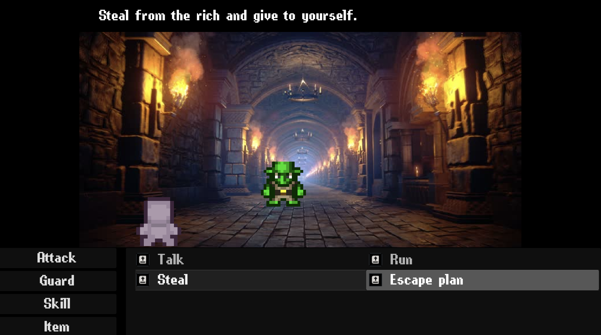
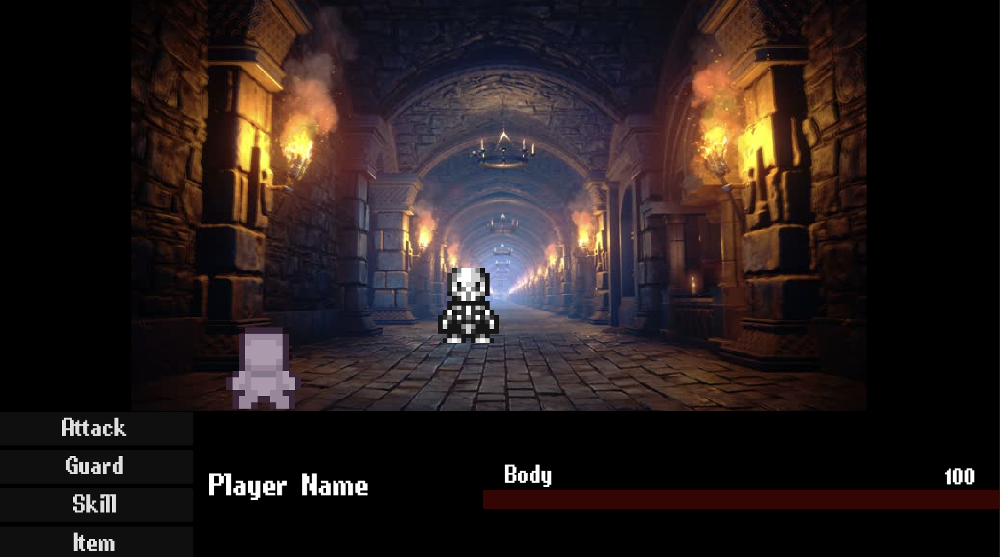
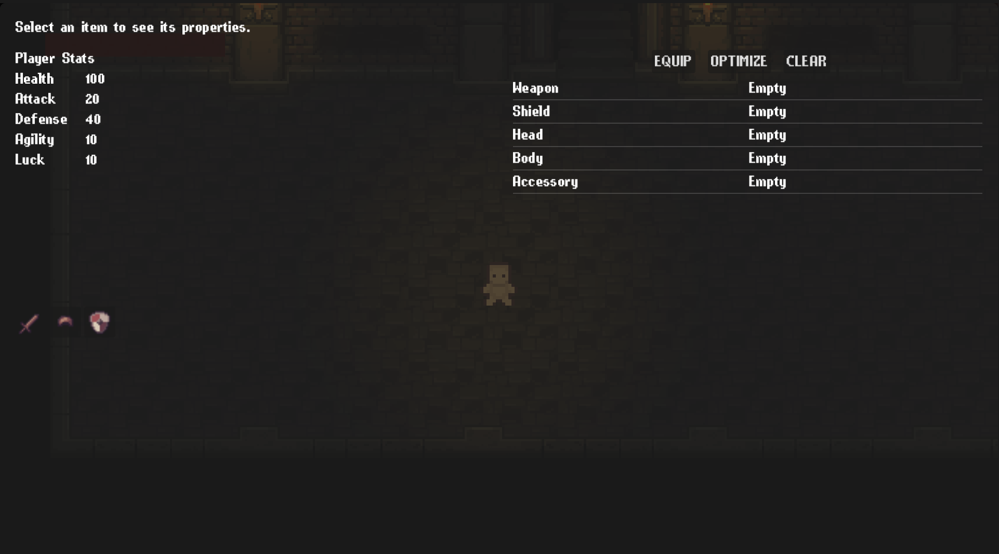

## 05.05
 - added a save point 

## 04.05
 - added a looting system
 - - barrels store potions (healing potion, damage potion and defense potion)
 - - - only healing potion is currently working 
 - - chests store equipment (weapon, shield, head, body, accessory)
 - - - added two-handed weapon, when equipping it, player cannot use shield
 - - bookshelves store skill books
 - - - using a book unlock new skill, available during combat

## 28.04
 - added new enemies (goblin, golem)
 - modified combat. added skills (talk, run, steal, escape plan)
 - added items inventory 
 - implemented healing mechanics

  

## 27.04
- added a combat scene
 * - currently "skill" button exits combat scene and "attack" only printing message in terminal

## 26.04
- added simple inventory 

## 22.04
- fixed floor traps "fast killing"
- added enemy "skeleton" with patrolling, player chasing and attacking functionality.  

## 24.03
- added floor traps -> animation and taking damage when spikes out

## 21.03
 - added very basic "health bar" ui and implemented take_damage function
 - moved Camera2D to Main scene, so it doesn't get deleted/created with every level
 - fixed player's "diagonal slide", forcing player to move only one direction even if 2 keys are pressed
 - modified some collision in level3

## 19.03 
 - fixed the torch sound, added sound fading away effect.
 - added a responsive starting screen/main menu ui
 - added a responsive pause menu
 - added a game sound 

# Catacombs v0.1.1
## 17.03 

### Player & Movement

* 4-directional movement and animations
* 4-directional idle animations

### Camera & Lighting

* Camera follow system
* Pointlight centered on player
* Torch: includes animation, pointlight and custom sound

### Systems

* Level transition logic

### DEMO

